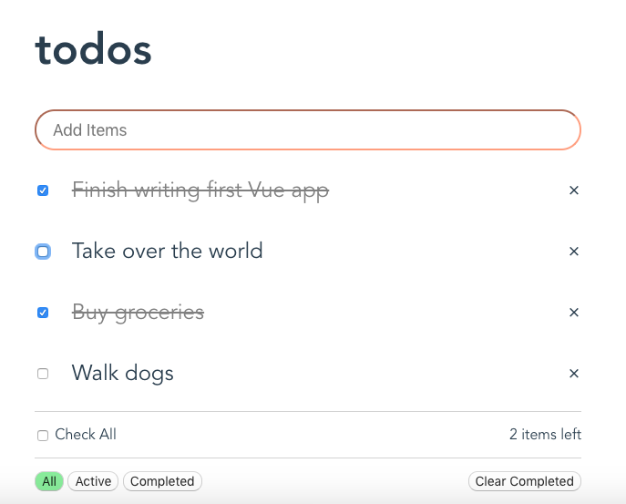

# Vue Todo

> A Basic To-Do App and My First Vue.js Project
> Allows users to add, edit, and delete tasks from their list.



## Build Setup

``` bash
# install dependencies
npm install

# serve with hot reload at localhost:8080
npm run dev
```

